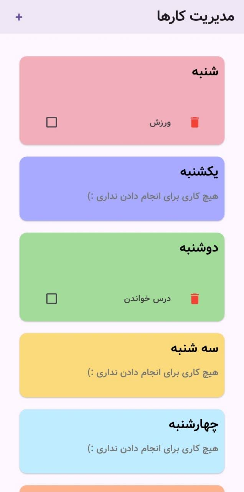

# 📝 Todo List - Flutter

یه اپلیکیشن ساده مدیریت کارهای روزانه با فلاتر.

## ✨ امکانات

- ✅ اضافه کردن کار برای هر روز هفته
- ✅ حذف کار
- ✅ تیک زدن کارهای انجام شده
- ✅ انیمیشن ورود آیتم‌ها
- ✅ راست‌چین (RTL) و فونت فارسی

## 🚧 در حال توسعه

- 🔄 ذخیره‌سازی دائمی (SharedPreferences / SQLite)

## 🛠️ تکنولوژی‌ها

- Flutter
- Riverpod (State Management)

## 📸 اسکرین‌شات

| صفحه اصلی | اضافه کردن کار |
|-----------|----------------|
|  |  |

## 🚀 اجرا

```bash
flutter pub get
flutter run